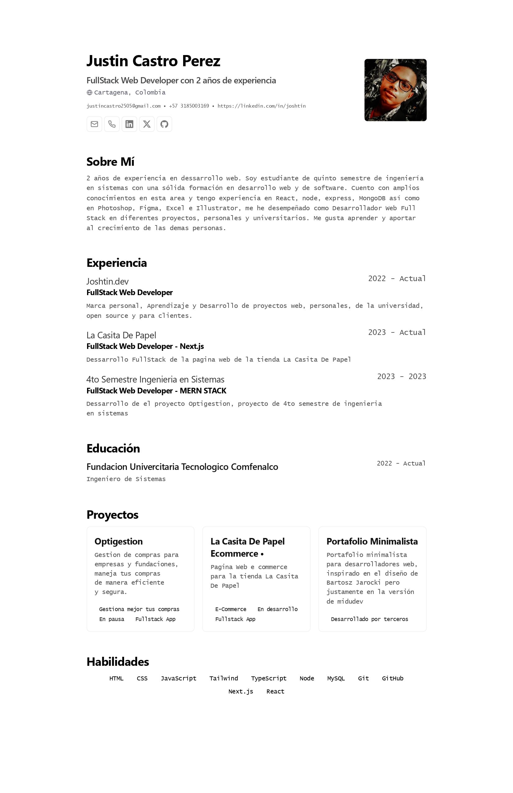

<div align='center'>
    <h1>Portafolio Minimalista</h1>
</div>


Basado en el diseño de <a href="https://github.com/BartoszJarocki/cv">``Bartosz Jarocki``</a> 

<br>

Version de <a href="https://github.com/midudev/minimalist-portfolio-json">``MiduDev``</a>

<hr>

## 💻⚒️ Stack

- [Astro]('https://astro.build/)
- [Nija Keys]('https://github.com/ssleptsov/ninja-keys')
- [Typescript]('https://www.typescriptlang.org/')

```bash
git clone https://github.com/joshtin2505/minimalist-portafolio.git
```

### Proximas Features

- English Lang

 [License: MIT](./Licence)
 
 [](https://app.netlify.com/sites/justin-cv/deploys)
